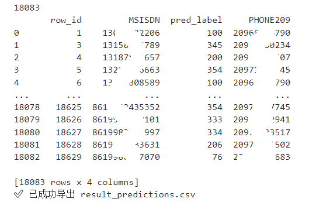

1.项目与环境搭建：明确课题背景和最终目标（用 GCN 做用户聚类/分类），并准备好开发环境。熟悉 O 域大数据平台（数据获取与计算环境），Python + PyTorch + PyTorch Geometric 环境搭建。

2.数据预处理：学习使用Hive SQL取出数据。保证原始数据（通话详单、小区信息等）能用于建图。去掉缺失值、异常值。对用户号码、基站eci、家宽209号码进行重新排序。

3.特征提取与分析：把原始业务数据转化为图数据（节点特征、边、标签）。
边（Edges）：通话记录（谁和谁打过电话）。
节点特征（Node features）：夜间常驻小区（反映用户活动范围）。
标签（Labels）：用户家庭宽带 209 号码（同一家庭归类到同一标签）。
探索分析：统计特征分布，看看是否有明显的分群规律。

4.GCN 模型构建与训练：基于构造的图进行半监督分类。使用 GCNConv 构造 2层 GCN
有标签数据：用于训练（监督学习部分）
无标签数据：通过图结构传播信息，利用半监督学习分类到已有家庭中
使用 交叉熵损失 + Adam 优化器

5.模型评估与优化：检验模型的实际效果，找出问题并改进。
指标：准确率 (accuracy)、召回率 (recall)、F1 值
调参：学习率、GCN 层数、隐藏维度、正则化、dropout 等

图 1. 根据家宽的传统分类方法示意图

图 2. GCN示意图

目标是：通过节点的输出logits预测某个节点是否为某一“家庭成员”。
一、核心建模思路：关系图 + GNN
🔧 1. 图定义（Graph）
节点（Node）：每个用户（MSISDN）
边（Edge）：两个用户之间有某种“联系”（通话）
节点特征（Node features）：夜间常驻基站eci统计
边特征（Edge features）：通话频率
节点标签：家庭宽带号（同一个家庭宽带下视为同一个家庭成员,对PHONE209从1到总数重新排序）

二、图构建步骤
先从基站6月常驻表中的ECI字段匹配semi.CELL_SITE_245_HZ中的cell_id可以得到某一个区县常驻用户电话。通过某区县的cell_id导出基站之间的通话记录。

节点：得荣县6月常驻用户18629个，保留夜间常驻基站
边：按相同拨入拨出电话统计后为1060个
标签：按常驻用户号码匹配出家宽号码，有对应家宽号码的则为训练集，无对应家宽号码的为需要进行预测的预测集

**用户特征：**多个夜间常驻基站eci

图 3. 用户特征

将特征进行Multi-hot编码，共532个eci，编码为长为532的二进制向量。

图 4. Multi-hot编码后的特征向量矩阵(前100个用户)

用户标签：对应的家庭宽带号码（共490个独立家宽号码

图 5. 用户特征个数分布图

图 6. 特征分布图

**用户标签：**对应的家庭宽带号码

图 7. 用户标签

图 8. 有标签家宽分布

图 9. 有标签节点图网络可视化示意图

准备数据，从有标签数据中执行数据分离，分割80%作为训练集，20%作为验证集监控模型泛化能力、防止过拟合。没有标签的数据作为预测集。
构建网络结构，堆叠两个GCNConv层，第一层的输入特征数等于每个节点的特征数，输出特征数为128。将潜在特征传递给第二层，第二层的输出节点数等于类数。通过在forward函数中，GCNConv可以接受节点特性，边的结构，边的权重，但这里只用到了节点特性和边的结构。

图 10. 网络参数

训练：随机初始化网络参数，将训练集节点特征输入网络得到输出后，计算交叉损失熵，使用adam优化器对网络参数进行更新。
预测：直接将预测集输入训练好的模型中，直接通过节点输出的logits判断属于哪一类
在训练50epoch、学习率 lr=0.01条件下，输出保存每次最优的验证准确率模型：

图 11. 训练过程

图 12. 损失函数曲线

图 13. 训练集和验证集准确率

学习情况总结：
模型收敛比较快：前几轮 loss 降得很快，说明学习率 lr=0.01 还行。
无明显过拟合：训练 acc 和验证 acc 曲线相近。
验证集表现优异：最后 val_acc 达到 87%，说明模型可以用来预测无标签节点。

保存最终模型，已经保存了 best_model_predict.pt，可以用它对无标签节点做预测。将对应的pre_lable映射回原始家宽PHONE209号码

图 14. 预测结果

图 15. 预测直方图
